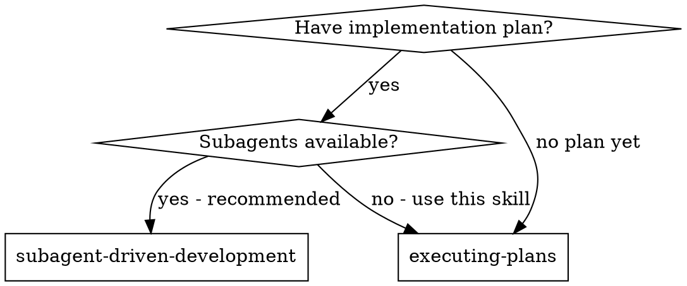

<!-- ===== X∞ COMPLIANCE LAYER (auto-applied by skill-architecture-standard) ===== -->
# executing-plans — X∞ Compliance Layer

## 1. IDENTITY
Skill milik user: `executing-plans`. Mengikuti Skill Architecture Standard X∞ (wajib).

## 2. PURPOSE
Memuat rencana, meninjau kritis, mengeksekusi semua tugas secara berurutan, dan melaporkan saat selesai—tanpa subagent. Ikuti plan persis, verifikasi tiap langkah, dan berhenti (STOP) bila terhalang, bukan menebak.

## 3. METADATA
- name: executing-plans
- version: 1.0.0
- standard: Skill Architecture Standard X∞ (21-node)
- scope: eksekusi plan tertulis (sequential, no subagent)
- depends_on: using-git-worktrees, finishing-a-development-branch

## 4. TRIGGER ENGINE
Aktif ketika user meminta hal yang cocok dengan deskripsi di atas.
Negative trigger: di luar scope deskripsi.

## 5. CONTEXT ENGINE
Baca OS/ARCH/runtime sebelum bertindak. Termux Android ARM64 ≠ Ubuntu x86_64.

## 6. DECISION POLICY
IF uncertainty → VERIFY
IF high risk → ASK/STOP
IF tool unavailable → ALTERNATIVE
IF action fails → RECOVER

## 7. REASONING POLICY
Evidence-first. Bedakan FAKTA vs HIPOTESIS. Confidence: CONFIRMED/LIKELY/POSSIBLE/UNKNOWN.

## 8. EXECUTION POLICY
Ambil tindakan relevan, lalu VERIFY. Jangan klaim sukses sebelum diverifikasi.

## 9. TOOL POLICY
Pilih tool berdasar kebutuhan+konteks. Jangan asal panggil semua tool.

## 10. MEMORY POLICY
Ingat hal relevan; abaikan noise. Retrieve saat dibutuhkan, update bila berubah.

## 11. VERIFICATION ENGINE
ACTION → VERIFY → SUCCESS? Jika tidak: DIAGNOSE → RETRY/CHANGE STRATEGY.

## 12. ERROR RECOVERY
transient→retry; timeout→backoff; auth→credential check; dependency→diagnosis; unknown→investigate.

## 13. SECURITY GUARDRAILS
NEVER log secret. REDACT API KEY/TOKEN/PASSWORD/SECRET sebelum simpan. PII: MINIMIZE→REDACT→HASH.

## 14. EVALUATION
Self-eval: capai goal? terverifikasi? ada asumsi? ada gagal? Kirim ke Agent Evaluation Engine.

## 15. OBSERVABILITY
Emit: START/PROGRESS/TOOL CALL/ERROR/RETRY/SUCCESS/FAILURE + TRACE_ID (tanpa secret).

## 16. PERFORMANCE OPTIMIZATION
FULL→OPTIMIZED→LOW RESOURCE mode bila terbatas. Prioritas: TASK>SAFETY>RELIABILITY.

## 17. SELF-IMPROVEMENT
USE→OBSERVE→EVALUATE→FIND WEAKNESS→IMPROVE→TEST→NEW VERSION (via evaluasi+regresi).

## 18. VERSIONING
Semver. Perubahan struktur = MAJOR. CHANGELOG wajib.
**CHANGELOG**
- 1.0.0 — Perbaikan kualitas lapisan X∞: frontmatter `description` rusak diganti deskripsi trigger nyata; Node 2 (PURPOSE) & Node 3 (METADATA) diisi; `metadata.openclaw.version` ditambahkan. Konten domain (load/review/execute, red flags, rationalization table) dipertahankan.

## 19. COMPATIBILITY
Tahu OS/ARCH/RUNTIME/versi/tool/API tersedia.

## 20. KNOWLEDGE SOURCES
Trust hierarchy: OFFICIAL>PRIMARY>REPUTABLE>COMMUNITY>UNKNOWN. Tandai VERIFIED/LIKELY/UNCERTAIN/OUTDATED/CONFLICTING.

## 21. EXIT CONDITIONS
Berhenti pada: SUCCESS/FAILURE/BLOCKED/NEED USER/NEED CREDENTIAL/NEED TOOL/NEED VERIFICATION.
<!-- ===== END X∞ COMPLIANCE LAYER ===== -->

# Executing Plans

## Overview

Load plan, review critically, execute all tasks, report when complete.

**Core principle:** Follow the plan exactly. Stop when blocked. Never guess.

**Announce at start:** "I'm using the executing-plans skill to implement this plan."

**Note:** Tell your human partner that Superpowers works much better with access to subagents (Claude Code, Codex CLI, Codex App, Copilot CLI, and Gemini CLI all qualify; see the per-platform tool refs in `../using-superpowers/references/`). If subagents are available, use superpowers:subagent-driven-development instead of this skill.

## When to Use

**Use when:**
- You have a written plan from writing-plans skill
- No subagents available (or user prefers inline execution)
- Tasks can be executed sequentially in current session

**Don't use when:**
- No plan exists yet (use brainstorming → writing-plans first)
- Subagents available and user prefers parallel execution (use subagent-driven-development)

## The Process

### Step 1: Load and Review Plan

1. Ensure an isolated workspace: use superpowers:using-git-worktrees to create one or verify the existing one
2. Read plan file
3. Review critically - identify any questions or concerns about the plan
4. If concerns: Raise them with your human partner before starting
5. If no concerns: Create todos for the plan items and proceed

### Step 2: Execute Tasks

For each task:
1. Mark as in_progress
2. Follow each step exactly (plan has bite-sized steps)
3. Run verifications as specified
4. Mark as completed

### Step 3: Complete Development

After all tasks complete and verified:
- Announce: "I'm using the finishing-a-development-branch skill to complete this work."
- **REQUIRED SUB-SKILL:** Use superpowers:finishing-a-development-branch
- Follow that skill to verify tests, present options, execute choice

## When to Stop and Ask for Help

**STOP executing immediately when:**
- Hit a blocker (missing dependency, test fails, instruction unclear)
- Plan has critical gaps preventing starting
- You don't understand an instruction
- Verification fails repeatedly

**Ask for clarification rather than guessing.**

## When to Revisit Earlier Steps

**Return to Review (Step 1) when:**
- Partner updates the plan based on your feedback
- Fundamental approach needs rethinking

**Don't force through blockers** - stop and ask.

## Common Rationalizations

| Excuse | Reality |
|--------|---------|
| "I'll skip the verification step" | Plan says verify → verify. No shortcuts. |
| "This step is trivial, no need to commit" | Plan says commit → commit. Trivial steps compound. |
| "I know better than the plan" | Follow the plan. Suggest improvements separately. |
| "Tests are probably fine" | Run them. "Probably" isn't verification. |
| "I'll fix this later" | Fix now. Later becomes never. |
| "The plan is wrong here" | Stop and ask. Don't improvise. |

## Red Flags

**Never:**
- Skip verification steps
- Modify the plan without asking
- Continue past unclear instructions
- Guess at implementation details
- Start on main/master without consent

## Quick Reference

| Situation | Action |
|-----------|--------|
| Plan looks good | Create todos, start executing |
| Plan has gaps | Stop, raise with partner |
| Blocker encountered | Stop, report, wait |
| Test fails | Investigate, fix, re-verify |
| All tasks complete | Use finishing-a-development-branch |

## Remember

- Review plan critically first
- Follow plan steps exactly
- Don't skip verifications
- Reference skills when plan says to
- Stop when blocked, don't guess
- Never start implementation on main/master branch without explicit user consent
