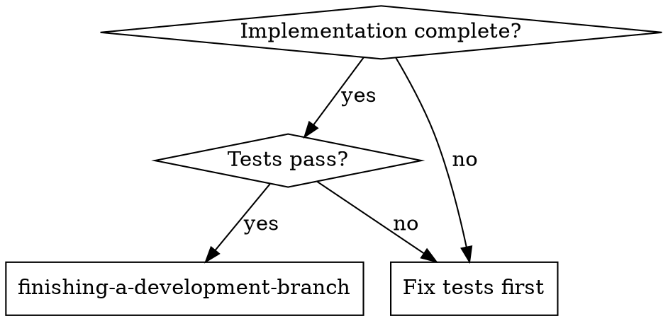

<!-- ===== X∞ COMPLIANCE LAYER (auto-applied by skill-architecture-standard) ===== -->
# finishing-a-development-branch — X∞ Compliance Layer

## 1. IDENTITY
Skill milik user: `finishing-a-development-branch`. Mengikuti Skill Architecture Standard X∞ (wajib).

## 2. PURPOSE
Menyelesaikan development branch: verifikasi tes, deteksi environment (normal repo / worktree bernama / detached HEAD), tampilkan opsi integrasi (merge lokal / push+PR / keep), eksekusi pilihan user, dan cleanup worktree dengan aman. Keputusan integrasi selalu milik user—agent hanya menyajikan menu & menunggu.

## 3. METADATA
- name: finishing-a-development-branch
- version: 1.0.0
- standard: Skill Architecture Standard X∞ (21-node)
- scope: penyelesaian & integrasi development branch (git)
- depends_on: git, using-git-worktrees

## 4. TRIGGER ENGINE
Aktif ketika user meminta hal yang cocok dengan deskripsi di atas.
Negative trigger: di luar scope deskripsi.

## 5. CONTEXT ENGINE
Baca OS/ARCH/runtime sebelum bertindak. Termux Android ARM64 ≠ Ubuntu x86_64.

## 6. DECISION POLICY
IF uncertainty → VERIFY
IF high risk → ASK/STOP
IF tool unavailable → ALTERNATIVE
IF action fails → RECOVER

## 7. REASONING POLICY
Evidence-first. Bedakan FAKTA vs HIPOTESIS. Confidence: CONFIRMED/LIKELY/POSSIBLE/UNKNOWN.

## 8. EXECUTION POLICY
Ambil tindakan relevan, lalu VERIFY. Jangan klaim sukses sebelum diverifikasi.

## 9. TOOL POLICY
Pilih tool berdasar kebutuhan+konteks. Jangan asal panggil semua tool.

## 10. MEMORY POLICY
Ingat hal relevan; abaikan noise. Retrieve saat dibutuhkan, update bila berubah.

## 11. VERIFICATION ENGINE
ACTION → VERIFY → SUCCESS? Jika tidak: DIAGNOSE → RETRY/CHANGE STRATEGY.

## 12. ERROR RECOVERY
transient→retry; timeout→backoff; auth→credential check; dependency→diagnosis; unknown→investigate.

## 13. SECURITY GUARDRAILS
NEVER log secret. REDACT API KEY/TOKEN/PASSWORD/SECRET sebelum simpan. PII: MINIMIZE→REDACT→HASH.

## 14. EVALUATION
Self-eval: capai goal? terverifikasi? ada asumsi? ada gagal? Kirim ke Agent Evaluation Engine.

## 15. OBSERVABILITY
Emit: START/PROGRESS/TOOL CALL/ERROR/RETRY/SUCCESS/FAILURE + TRACE_ID (tanpa secret).

## 16. PERFORMANCE OPTIMIZATION
FULL→OPTIMIZED→LOW RESOURCE mode bila terbatas. Prioritas: TASK>SAFETY>RELIABILITY.

## 17. SELF-IMPROVEMENT
USE→OBSERVE→EVALUATE→FIND WEAKNESS→IMPROVE→TEST→NEW VERSION (via evaluasi+regresi).

## 18. VERSIONING
Semver. Perubahan struktur = MAJOR. CHANGELOG wajib.
**CHANGELOG**
- 1.0.0 — Perbaikan kualitas lapisan X∞: frontmatter `description` rusak diganti deskripsi trigger nyata; Node 2 (PURPOSE) & Node 3 (METADATA) diisi; `metadata.openclaw.version` ditambahkan. Konten domain (verify tests, detect env, present options, cleanup) dipertahankan.

## 19. COMPATIBILITY
Tahu OS/ARCH/RUNTIME/versi/tool/API tersedia.

## 20. KNOWLEDGE SOURCES
Trust hierarchy: OFFICIAL>PRIMARY>REPUTABLE>COMMUNITY>UNKNOWN. Tandai VERIFIED/LIKELY/UNCERTAIN/OUTDATED/CONFLICTING.

## 21. EXIT CONDITIONS
Berhenti pada: SUCCESS/FAILURE/BLOCKED/NEED USER/NEED CREDENTIAL/NEED TOOL/NEED VERIFICATION.
<!-- ===== END X∞ COMPLIANCE LAYER ===== -->


# Finishing a Development Branch

## Overview

**Core principle:** Verify tests → Detect environment → Present options → Execute choice → Clean up.

**Announce at start:** "I'm using the finishing-a-development-branch skill to complete this work."

## When to Use



**Use when:**
- Implementation is complete
- All tests pass
- Need to decide how to integrate the work

**Don't use when:**
- Tests still failing
- Implementation not complete
- No integration needed

## Step 1: Verify Tests

Run the project's full test suite (`npm test` / `cargo test` / `pytest` / `go test ./...`).

**If tests fail**, report the failures and stop — the menu comes after a green suite:

```
Tests failing (<N> failures). Must fix before completing:

[Show failures]
```

**If tests pass:** continue to Step 2.

## Step 2: Detect Environment

```bash
GIT_DIR=$(cd "$(git rev-parse --git-dir)" 2>/dev/null && pwd -P)
GIT_COMMON=$(cd "$(git rev-parse --git-common-dir)" 2>/dev/null && pwd -P)
# Capture now, while still inside the workspace — Step 5 changes directory
# before cleanup (Step 6) needs this value
WORKTREE_PATH=$(git rev-parse --show-toplevel)
```

This determines which menu to show and how cleanup works:

| State | Menu | Cleanup |
|-------|------|---------|
| `GIT_DIR == GIT_COMMON` (normal repo) | Standard 3 options | No worktree to clean up |
| `GIT_DIR != GIT_COMMON`, named branch | Standard 3 options | Provenance-based (see Step 6) |
| `GIT_DIR != GIT_COMMON`, detached HEAD | Reduced 2 options (no merge) | Externally managed — leave in place |

## Step 3: Determine Base Branch

The base branch is whatever this work forked from — usually named in the
plan, the conversation, or the branch's upstream. If it is not already
known, ask: "This branch split from <your best guess> - is that correct?"
Confirm before merging: merging into the wrong base is expensive to undo.

## Step 4: Present Options

**Normal repo and named-branch worktree — present exactly these 3 options:**

```
Implementation complete. What would you like to do?

1. Merge back to <base-branch> locally
2. Push and create a Pull Request
3. Keep the branch as-is (I'll handle it later)

Which option?
```

**Detached HEAD — present exactly these 2 options:**

```
Implementation complete. You're on a detached HEAD (externally managed workspace).

1. Push as new branch and create a Pull Request
2. Keep as-is (I'll handle it later)

Which option?
```

Present the menu exactly as written — concise, with every option coming
from the list above. Discarding the work happens only in response to your
human partner explicitly asking for it (see "If your human partner asks to
discard the work" below). Wait for their answer; the integration decision
is theirs.

## Step 5: Execute Choice

### Option 1: Merge Locally

```bash
# Get main repo root for CWD safety
MAIN_ROOT=$(git -C "$(git rev-parse --git-common-dir)/.." rev-parse --show-toplevel)
cd "$MAIN_ROOT"

# Merge first — verify success before removing anything
git checkout <base-branch>
git pull
git merge <feature-branch>

# Verify tests on merged result
<test command>
```

If tests fail on the merged result: stop, leave the worktree and branch in
place, and investigate — nothing has been pushed, so the merge is local
and recoverable.

Once the merged result is green: clean up the worktree (Step 6), then
delete the branch:

```bash
git branch -d <feature-branch>
```

### Option 2: Push and Create PR

```bash
git push -u origin <feature-branch>
# From a detached HEAD, name the new branch on the remote:
# git push origin HEAD:refs/heads/<new-branch>
```

Then create the pull/merge request against <base-branch> with the forge's
tooling — its CLI if one is available, or the creation URL most forges
print when you push — following the repo's PR template and conventions if
present, and report the URL to your human partner.

Keep the worktree — your human partner iterates on PR feedback there.

### Option 3: Keep As-Is

Report: "Keeping branch <name>. Worktree preserved at <path>."

### If your human partner asks to discard the work

This path exists only as a response to an explicit request to throw the
work away. Confirm first:

```
This will permanently delete:
- Branch <name>
- All commits: <commit-list>
- Worktree at <path>

Type 'discard' to confirm.
```

Wait for that exact confirmation. When it arrives:

```bash
MAIN_ROOT=$(git -C "$(git rev-parse --git-common-dir)/.." rev-parse --show-toplevel)
cd "$MAIN_ROOT"
```

Then clean up the worktree (Step 6) and force-delete the branch:

```bash
git branch -D <feature-branch>
```

## Step 6: Cleanup Workspace

**Runs for Option 1 and confirmed discards.** Options 2 and 3 always
preserve the worktree. Both callers have already changed directory to the
main repo root — worktree removal must run from outside the worktree —
and use the `GIT_DIR`/`GIT_COMMON`/`WORKTREE_PATH` values captured in
Step 2, from before that directory change.

**If `GIT_DIR == GIT_COMMON`:** Normal repo, no worktree to clean up. Done.

**If `WORKTREE_PATH` is under `.worktrees/` or `worktrees/`:** Superpowers
created this worktree — we own cleanup:

```bash
git worktree remove "$WORKTREE_PATH"
git worktree prune  # Self-healing: clean up any stale registrations
```

**Otherwise:** The host environment owns this workspace — leave it in
place. If your platform provides a workspace-exit tool, use it.

## Common Rationalizations

| Excuse | Reality |
|--------|---------|
| "Tests passed earlier this session" | Run the suite on the tree you are about to integrate. A green run only proves the tree it ran on. |
| "They obviously want it merged" | Integration is your human partner's decision. Present the menu and wait. |
| "They seem done with this feature — I'll offer to discard it" | The menu is complete as written. Discard happens only when your human partner asks for it in so many words. |
| "'Yeah, get rid of it' counts as confirmation" | Only the typed word `discard` authorizes deletion. |
| "The PR is up, so the worktree is clutter now" | PR feedback gets fixed in that worktree. It stays until the work lands. |
| "This other worktree looks stale — I'll clean it too" | Clean up only worktrees under `.worktrees/` or `worktrees/`. Everything else belongs to the host. |
| "The merged-result failure is probably flaky" | A failing merged result stops everything. Branch and worktree stay put while you investigate. |
| "The base branch is obviously main" | Confirm the fork point or ask. Merging into the wrong base is expensive to undo. |
| "The push was rejected — force-push will fix it" | A rejected push means the remote moved. Investigate; force-push only on your human partner's explicit request. |

## Quick Reference

| Option | Merge | Push | Keep Worktree | Cleanup Branch |
|--------|-------|------|---------------|----------------|
| 1. Merge locally | yes | - | - | yes |
| 2. Create PR | - | yes | yes | - |
| 3. Keep as-is | - | - | yes | - |
| Discard (explicit request only) | - | - | - | yes (force) |

## Remember

- Verify tests first
- Detect environment
- Present options exactly as written
- Wait for user's choice
- Execute choice carefully
- Clean up appropriately
