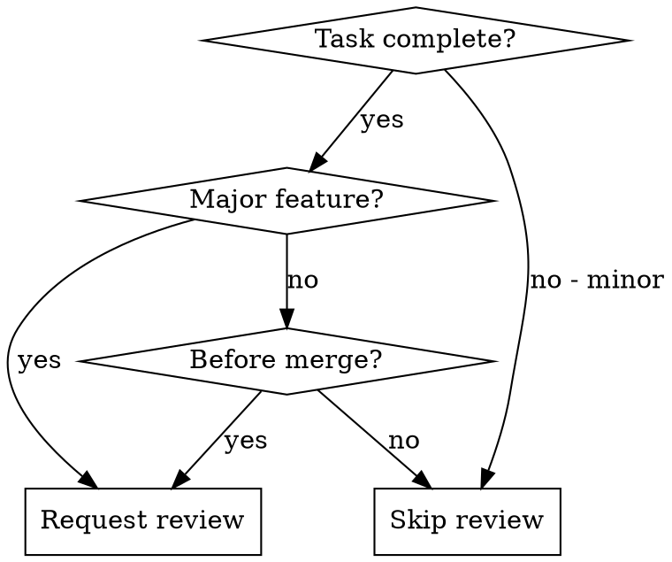

<!-- ===== X∞ COMPLIANCE LAYER (auto-applied by skill-architecture-standard) ===== -->
# requesting-code-review — X∞ Compliance Layer

## 1. IDENTITY
Skill milik user: `requesting-code-review`. Mengikuti Skill Architecture Standard X∞ (wajib).

## 2. PURPOSE
Menyediakan kemampuan requesting-code-review kepada agent saat relevan.

## 3. METADATA
- name: requesting-code-review
- version: 1.0.0
- standard: Skill Architecture Standard X∞ (21-node)
- scope: lihat body domain
- depends_on: tidak ada (mandiri)

## 4. TRIGGER ENGINE
Aktif ketika user meminta hal yang cocok dengan deskripsi di atas.
Negative trigger: di luar scope deskripsi.

## 5. CONTEXT ENGINE
Baca OS/ARCH/runtime sebelum bertindak. Termux Android ARM64 ≠ Ubuntu x86_64.

## 6. DECISION POLICY
IF uncertainty → VERIFY
IF high risk → ASK/STOP
IF tool unavailable → ALTERNATIVE
IF action fails → RECOVER

## 7. REASONING POLICY
Evidence-first. Bedakan FAKTA vs HIPOTESIS. Confidence: CONFIRMED/LIKELY/POSSIBLE/UNKNOWN.

## 8. EXECUTION POLICY
Ambil tindakan relevan, lalu VERIFY. Jangan klaim sukses sebelum diverifikasi.

## 9. TOOL POLICY
Pilih tool berdasar kebutuhan+konteks. Jangan asal panggil semua tool.

## 10. MEMORY POLICY
Ingat hal relevan; abaikan noise. Retrieve saat dibutuhkan, update bila berubah.

## 11. VERIFICATION ENGINE
ACTION → VERIFY → SUCCESS? Jika tidak: DIAGNOSE → RETRY/CHANGE STRATEGY.

## 12. ERROR RECOVERY
transient→retry; timeout→backoff; auth→credential check; dependency→diagnosis; unknown→investigate.

## 13. SECURITY GUARDRAILS
NEVER log secret. REDACT API KEY/TOKEN/PASSWORD/SECRET sebelum simpan. PII: MINIMIZE→REDACT→HASH.

## 14. EVALUATION
Self-eval: capai goal? terverifikasi? ada asumsi? ada gagal? Kirim ke Agent Evaluation Engine.

## 15. OBSERVABILITY
Emit: START/PROGRESS/TOOL CALL/ERROR/RETRY/SUCCESS/FAILURE + TRACE_ID (tanpa secret).

## 16. PERFORMANCE OPTIMIZATION
FULL→OPTIMIZED→LOW RESOURCE mode bila terbatas. Prioritas: TASK>SAFETY>RELIABILITY.

## 17. SELF-IMPROVEMENT
USE→OBSERVE→EVALUATE→FIND WEAKNESS→IMPROVE→TEST→NEW VERSION (via evaluasi+regresi).

## 18. VERSIONING
Semver. Perubahan struktur = MAJOR. CHANGELOG wajib.
**CHANGELOG**
- 1.0.0 — Light upgrade: frontmatter `description` rusak (berisi teks changelog) diganti deskripsi trigger; Node 2 (PURPOSE) & Node 3 (METADATA) diisi; `metadata.openclaw.version` diset 1.0.0. Body domain dipertahankan.

## 19. COMPATIBILITY
Tahu OS/ARCH/RUNTIME/versi/tool/API tersedia.

## 20. KNOWLEDGE SOURCES
Trust hierarchy: OFFICIAL>PRIMARY>REPUTABLE>COMMUNITY>UNKNOWN. Tandai VERIFIED/LIKELY/UNCERTAIN/OUTDATED/CONFLICTING.

## 21. EXIT CONDITIONS
Berhenti pada: SUCCESS/FAILURE/BLOCKED/NEED USER/NEED CREDENTIAL/NEED TOOL/NEED VERIFICATION.
<!-- ===== END X∞ COMPLIANCE LAYER ===== -->


# Requesting Code Review

## Overview

Dispatch a code reviewer subagent to catch issues before they cascade. The reviewer gets precisely crafted context for evaluation — never your session's history.

**Core principle:** Review early, review often.

## When to Use



**Mandatory:**
- After each task in subagent-driven development
- After completing major feature
- Before merge to main

**Optional but valuable:**
- When stuck (fresh perspective)
- Before refactoring (baseline check)
- After fixing complex bug

## How to Request

**1. Get git SHAs:**
```bash
BASE_SHA=$(git rev-parse HEAD~1)  # or origin/main
HEAD_SHA=$(git rev-parse HEAD)
```

**2. Dispatch code reviewer subagent:**

Dispatch a `general-purpose` subagent, filling the template at [code-reviewer.md](code-reviewer.md)

**Placeholders:**
- `{DESCRIPTION}` - Brief summary of what you built
- `{PLAN_OR_REQUIREMENTS}` - What it should do
- `{BASE_SHA}` - Starting commit
- `{HEAD_SHA}` - Ending commit

**3. Act on feedback:**
- Fix Critical issues immediately
- Fix Important issues before proceeding
- Note Minor issues for later
- Push back if reviewer is wrong (with reasoning)

## Example

```
[Just completed Task 2: Add verification function]

You: Let me request code review before proceeding.

BASE_SHA=$(git log --oneline | grep "Task 1" | head -1 | awk '{print $1}')
HEAD_SHA=$(git rev-parse HEAD)

[Dispatch code reviewer subagent]
  DESCRIPTION: Added verifyIndex() and repairIndex() with 4 issue types
  PLAN_OR_REQUIREMENTS: Task 2 from docs/superpowers/plans/deployment-plan.md
  BASE_SHA: a7981ec
  HEAD_SHA: 3df7661

[Subagent returns]:
  Strengths: Clean architecture, real tests
  Issues:
    Important: Missing progress indicators
    Minor: Magic number (100) for reporting interval
  Assessment: Ready to proceed

You: [Fix progress indicators]
[Continue to Task 3]
```

## Common Rationalizations

| Excuse | Reality |
|--------|---------|
| "I'll just review the diff myself" | You're the coordinator — dispatch a reviewer subagent. |
| "The reviewer needs my whole session history" | Hand it precisely crafted context, never your session's history. |
| "This is too simple for review" | Simple things have bugs too. Review anyway. |
| "I already know what's wrong" | Fresh eyes catch what you miss. Dispatch reviewer. |
| "Review takes too long" | Catching bugs now saves hours later. |

## Red Flags

**Never:**
- Skip review because "it's simple"
- Ignore Critical issues
- Proceed with unfixed Important issues
- Argue with valid technical feedback

**If reviewer wrong:**
- Push back with technical reasoning
- Show code/tests that prove it works
- Request clarification

## Quick Reference

| Situation | Action |
|-----------|--------|
| Task complete | Request review |
| Major feature done | Request review |
| Before merge | Request review |
| Stuck on problem | Request review (fresh perspective) |
| Reviewer says Critical | Fix immediately |
| Reviewer says Important | Fix before proceeding |
| Reviewer says Minor | Note for later |
| Reviewer wrong | Push back with evidence |

See template at: [code-reviewer.md](code-reviewer.md)
