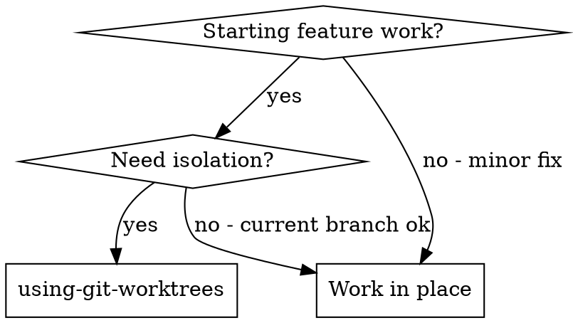

# using-git-worktrees — X∞ Compliance Layer

## 1. IDENTITY
Skill milik user: `using-git-worktrees`. Mengikuti Skill Architecture Standard X∞ (wajib).

## 2. PURPOSE
Menyediakan kemampuan using-git-worktrees kepada agent saat relevan.

## 3. METADATA
- name: using-git-worktrees
- version: 1.0.0
- standard: Skill Architecture Standard X∞ (21-node)
- scope: lihat body domain
- depends_on: tidak ada (mandiri)

## 4. TRIGGER ENGINE
Aktif ketika user meminta hal yang cocok dengan deskripsi di atas.
Negative trigger: di luar scope deskripsi.

## 5. CONTEXT ENGINE
Baca OS/ARCH/runtime sebelum bertindak. Termux Android ARM64 ≠ Ubuntu x86_64.

## 6. DECISION POLICY
IF uncertainty → VERIFY
IF high risk → ASK/STOP
IF tool unavailable → ALTERNATIVE
IF action fails → RECOVER

## 7. REASONING POLICY
Evidence-first. Bedakan FAKTA vs HIPOTESIS. Confidence: CONFIRMED/LIKELY/POSSIBLE/UNKNOWN.

## 8. EXECUTION POLICY
Ambil tindakan relevan, lalu VERIFY. Jangan klaim sukses sebelum diverifikasi.

## 9. TOOL POLICY
Pilih tool berdasar kebutuhan+konteks. Jangan asal panggil semua tool.

## 10. MEMORY POLICY
Ingat hal relevan; abaikan noise. Retrieve saat dibutuhkan, update bila berubah.

## 11. VERIFICATION ENGINE
ACTION → VERIFY → SUCCESS? Jika tidak: DIAGNOSE → RETRY/CHANGE STRATEGY.

## 12. ERROR RECOVERY
transient→retry; timeout→backoff; auth→credential check; dependency→diagnosis; unknown→investigate.

## 13. SECURITY GUARDRAILS
NEVER log secret. REDACT API KEY/TOKEN/PASSWORD/SECRET sebelum simpan. PII: MINIMIZE→REDACT→HASH.

## 14. EVALUATION
Self-eval: capai goal? terverifikasi? ada asumsi? ada gagal? Kirim ke Agent Evaluation Engine.

## 15. OBSERVABILITY
Emit: START/PROGRESS/TOOL CALL/ERROR/RETRY/SUCCESS/FAILURE + TRACE_ID (tanpa secret).

## 16. PERFORMANCE OPTIMIZATION
FULL→OPTIMIZED→LOW RESOURCE mode bila terbatas. Prioritas: TASK>SAFETY>RELIABILITY.

## 17. SELF-IMPROVEMENT
USE→OBSERVE→EVALUATE→FIND WEAKNESS→IMPROVE→TEST→NEW VERSION (via evaluasi+regresi).

## 18. VERSIONING
Semver. Perubahan struktur = MAJOR. CHANGELOG wajib.
**CHANGELOG**
- 1.0.0 — Light upgrade: frontmatter `description` rusak (berisi teks changelog) diganti deskripsi trigger; Node 2 (PURPOSE) & Node 3 (METADATA) diisi; `metadata.openclaw.version` diset 1.0.0. Body domain dipertahankan.

## 19. COMPATIBILITY
Tahu OS/ARCH/RUNTIME/versi/tool/API tersedia.

## 20. KNOWLEDGE SOURCES
Trust hierarchy: OFFICIAL>PRIMARY>REPUTABLE>COMMUNITY>UNKNOWN. Tandai VERIFIED/LIKELY/UNCERTAIN/OUTDATED/CONFLICTING.

## 21. EXIT CONDITIONS
Berhenti pada: SUCCESS/FAILURE/BLOCKED/NEED USER/NEED CREDENTIAL/NEED TOOL/NEED VERIFICATION.
# Using Git Worktrees

## Overview

Ensure work happens in an isolated workspace. Prefer your platform's native worktree tools. Fall back to manual git worktrees only when no native tool is available.

**Core principle:** Detect existing isolation first. Then use native tools. Then fall back to git. Never fight the harness.

**Announce at start:** "I'm using the using-git-worktrees skill to set up an isolated workspace."

## When to Use



**Use when:**
- Starting feature work that needs isolation
- Before executing implementation plans
- Need to protect current branch from changes

**Don't use when:**
- Simple bug fix on current branch
- No isolation needed
- Working on main/master intentionally

## Step 0: Detect Existing Isolation

**Before creating anything, check if you are already in an isolated workspace.**

```bash
GIT_DIR=$(cd "$(git rev-parse --git-dir)" 2>/dev/null && pwd -P)
GIT_COMMON=$(cd "$(git rev-parse --git-common-dir)" 2>/dev/null && pwd -P)
BRANCH=$(git branch --show-current)
```

**Submodule guard:** `GIT_DIR != GIT_COMMON` is also true inside git submodules. Before concluding "already in a worktree," verify you are not in a submodule:

```bash
# If this returns a path, you're in a submodule, not a worktree — treat as normal repo
git rev-parse --show-superproject-working-tree 2>/dev/null
```

**If `GIT_DIR != GIT_COMMON` (and not a submodule):** You are already in a linked worktree. Skip to Step 2 (Project Setup). Do NOT create another worktree.

Report with branch state:
- On a branch: "Already in isolated workspace at `<path>` on branch `<name>`."
- Detached HEAD: "Already in isolated workspace at `<path>` (detached HEAD, externally managed). Branch creation needed at finish time."

**If `GIT_DIR == GIT_COMMON` (or in a submodule):** You are in a normal repo checkout.

Has the user already indicated their worktree preference in your instructions? If not, ask for consent before creating a worktree:

> "Would you like me to set up an isolated worktree? It protects your current branch from changes."

Honor any existing declared preference without asking. If the user declines consent, work in place and skip to Step 2.

## Step 1: Create Isolated Workspace

**You have two mechanisms. Try them in this order.**

### 1a. Native Worktree Tools (preferred)

The user has asked for an isolated workspace (Step 0 consent). Do you already have a way to create a worktree? It might be a tool with a name like `EnterWorktree`, `WorktreeCreate`, a `/worktree` command, or a `--worktree` flag. If you do, use it and skip to Step 2.

Native tools handle directory placement, branch creation, and cleanup automatically. Using `git worktree add` when you have a native tool creates phantom state your harness can't see or manage.

Only proceed to Step 1b if you have no native worktree tool available.

### 1b. Git Worktree Fallback

**Only use this if Step 1a does not apply** — you have no native worktree tool available. Create a worktree manually using git.

#### Directory Selection

Follow this priority order. Explicit user preference always beats observed filesystem state.

1. **Check your instructions for a declared worktree directory preference.** If the user has already specified one, use it without asking.

2. **Check for an existing project-local worktree directory:**
   ```bash
   ls -d .worktrees 2>/dev/null     # Preferred (hidden)
   ls -d worktrees 2>/dev/null      # Alternative
   ```
   If found, use it. If both exist, `.worktrees` wins.

3. **If there is no other guidance available**, default to `.worktrees/` at the project root.

#### Safety Verification (project-local directories only)

**MUST verify directory is ignored before creating worktree:**

```bash
git check-ignore -q .worktrees 2>/dev/null || git check-ignore -q worktrees 2>/dev/null
```

**If NOT ignored:** Add to .gitignore, commit the change, then proceed.

**Why critical:** Prevents accidentally committing worktree contents to repository.

#### Create the Worktree

```bash
# Determine path based on chosen location
path="$LOCATION/$BRANCH_NAME"

git worktree add "$path" -b "$BRANCH_NAME"
cd "$path"
```

**Sandbox fallback:** If `git worktree add` fails with a permission error (sandbox denial), tell the user the sandbox blocked worktree creation and you're working in the current directory instead. Then run setup and baseline tests in place.

## Step 2: Project Setup

Auto-detect and run appropriate setup:

```bash
# Node.js
if [ -f package.json ]; then npm install; fi

# Rust
if [ -f Cargo.toml ]; then cargo build; fi

# Python
if [ -f requirements.txt ]; then pip install -r requirements.txt; fi
if [ -f pyproject.toml ]; then poetry install; fi

# Go
if [ -f go.mod ]; then go mod download; fi
```

## Step 3: Verify Clean Baseline

Run tests to ensure workspace starts clean:

```bash
# Use project-appropriate command
npm test / cargo test / pytest / go test ./...
```

**If tests fail:** Report failures, ask whether to proceed or investigate.

**If tests pass:** Report ready.

### Report

```
Worktree ready at <full-path>
Tests passing (<N> tests, 0 failures)
Ready to implement <feature-name>
```

## Common Rationalizations

| Excuse | Reality |
|--------|---------|
| "I'm obviously not in a worktree — no need to check" | Run Step 0. Harness-created isolation and submodules both fool eyeballing; the detection commands settle it. |
| "`git worktree add` is quicker than hunting for a native tool" | A native tool (e.g. `EnterWorktree`) owns placement, branching, and cleanup. Bypassing it is the #1 mistake — it creates phantom state your harness can't see or manage. |
| "The worktree directory is surely ignored already" | Run `git check-ignore`. An unignored worktree directory commits the whole tree into the repo. |
| "Any directory name works" | Explicit instructions beat an existing project-local directory, which beats the `.worktrees/` default. |
| "The workspace is fresh — baseline tests can wait" | A dirty baseline makes every later failure ambiguous. Run the tests now; proceeding past failures is your human partner's call. |
| "I'll just work in the current directory" | Isolation protects your current branch. Use a worktree. |
| "Worktrees are too complicated" | They're not. Follow the steps. |

## Quick Reference

| Situation | Action |
|-----------|--------|
| Already in linked worktree | Skip creation (Step 0) |
| In a submodule | Treat as normal repo (Step 0 guard) |
| Native worktree tool available | Use it (Step 1a) |
| No native tool | Git worktree fallback (Step 1b) |
| `.worktrees/` exists | Use it (verify ignored) |
| `worktrees/` exists | Use it (verify ignored) |
| Both exist | Use `.worktrees/` |
| Neither exists | Check instruction file, then default `.worktrees/` |
| Directory not ignored | Add to .gitignore + commit |
| Permission error on create | Sandbox fallback, work in place |
| Tests fail during baseline | Report failures + ask |
| No package.json/Cargo.toml | Skip dependency install |

## Remember

- Detect existing isolation first
- Use native tools when available
- Fall back to git worktrees only when needed
- Verify directory is ignored
- Run baseline tests
- Never fight the harness
