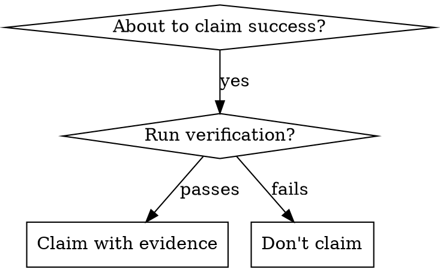

# verification-before-completion — X∞ Compliance Layer

## 1. IDENTITY
Skill milik user: `verification-before-completion`. Mengikuti Skill Architecture Standard X∞ (wajib).

## 2. PURPOSE
Menyediakan kemampuan verification-before-completion kepada agent saat relevan.

## 3. METADATA
- name: verification-before-completion
- version: 1.0.0
- standard: Skill Architecture Standard X∞ (21-node)
- scope: lihat body domain
- depends_on: tidak ada (mandiri)

## 4. TRIGGER ENGINE
Aktif ketika user meminta hal yang cocok dengan deskripsi di atas.
Negative trigger: di luar scope deskripsi.

## 5. CONTEXT ENGINE
Baca OS/ARCH/runtime sebelum bertindak. Termux Android ARM64 ≠ Ubuntu x86_64.

## 6. DECISION POLICY
IF uncertainty → VERIFY
IF high risk → ASK/STOP
IF tool unavailable → ALTERNATIVE
IF action fails → RECOVER

## 7. REASONING POLICY
Evidence-first. Bedakan FAKTA vs HIPOTESIS. Confidence: CONFIRMED/LIKELY/POSSIBLE/UNKNOWN.

## 8. EXECUTION POLICY
Ambil tindakan relevan, lalu VERIFY. Jangan klaim sukses sebelum diverifikasi.

## 9. TOOL POLICY
Pilih tool berdasar kebutuhan+konteks. Jangan asal panggil semua tool.

## 10. MEMORY POLICY
Ingat hal relevan; abaikan noise. Retrieve saat dibutuhkan, update bila berubah.

## 11. VERIFICATION ENGINE
ACTION → VERIFY → SUCCESS? Jika tidak: DIAGNOSE → RETRY/CHANGE STRATEGY.

## 12. ERROR RECOVERY
transient→retry; timeout→backoff; auth→credential check; dependency→diagnosis; unknown→investigate.

## 13. SECURITY GUARDRAILS
NEVER log secret. REDACT API KEY/TOKEN/PASSWORD/SECRET sebelum simpan. PII: MINIMIZE→REDACT→HASH.

## 14. EVALUATION
Self-eval: capai goal? terverifikasi? ada asumsi? ada gagal? Kirim ke Agent Evaluation Engine.

## 15. OBSERVABILITY
Emit: START/PROGRESS/TOOL CALL/ERROR/RETRY/SUCCESS/FAILURE + TRACE_ID (tanpa secret).

## 16. PERFORMANCE OPTIMIZATION
FULL→OPTIMIZED→LOW RESOURCE mode bila terbatas. Prioritas: TASK>SAFETY>RELIABILITY.

## 17. SELF-IMPROVEMENT
USE→OBSERVE→EVALUATE→FIND WEAKNESS→IMPROVE→TEST→NEW VERSION (via evaluasi+regresi).

## 18. VERSIONING
Semver. Perubahan struktur = MAJOR. CHANGELOG wajib.
**CHANGELOG**
- 1.0.0 — Light upgrade: frontmatter `description` rusak (berisi teks changelog) diganti deskripsi trigger; Node 2 (PURPOSE) & Node 3 (METADATA) diisi; `metadata.openclaw.version` diset 1.0.0. Body domain dipertahankan.

## 19. COMPATIBILITY
Tahu OS/ARCH/RUNTIME/versi/tool/API tersedia.

## 20. KNOWLEDGE SOURCES
Trust hierarchy: OFFICIAL>PRIMARY>REPUTABLE>COMMUNITY>UNKNOWN. Tandai VERIFIED/LIKELY/UNCERTAIN/OUTDATED/CONFLICTING.

## 21. EXIT CONDITIONS
Berhenti pada: SUCCESS/FAILURE/BLOCKED/NEED USER/NEED CREDENTIAL/NEED TOOL/NEED VERIFICATION.
# Verification Before Completion

## Overview

**Core principle:** Evidence before claims, always.

**Violating the letter of this rule is violating the spirit of this rule.**

## When to Use



**ALWAYS before:**
- ANY variation of success/completion claims
- ANY expression of satisfaction
- ANY positive statement about work state
- Committing, PR creation, task completion
- Moving to next task
- Delegating to agents

## The Iron Law

```
NO COMPLETION CLAIMS WITHOUT FRESH VERIFICATION EVIDENCE
```

If you haven't run the verification command in this message, you cannot claim it passes.

## The Gate Function

```
BEFORE claiming any status or expressing satisfaction:

1. IDENTIFY: What command proves this claim?
2. RUN: Execute the FULL command (fresh, complete)
3. READ: Full output, check exit code, count failures
4. VERIFY: Does output confirm the claim?
   - If NO: State actual status with evidence
   - If YES: State claim WITH evidence
5. ONLY THEN: Make the claim

Skip any step = lying, not verifying
```

## Common Failures

| Claim | Requires | Not Sufficient |
|-------|----------|----------------|
| Tests pass | Test command output: 0 failures | Previous run, "should pass" |
| Linter clean | Linter output: 0 errors | Partial check, extrapolation |
| Build succeeds | Build command: exit 0 | Linter passing, logs look good |
| Bug fixed | Test original symptom: passes | Code changed, assumed fixed |
| Regression test works | Red-green cycle verified | Test passes once |
| Agent completed | VCS diff shows changes | Agent reports "success" |
| Requirements met | Line-by-line checklist | Tests passing |

## Key Patterns

**Tests:**
```
✅ [Run test command] [See: 34/34 pass] "All tests pass"
❌ "Should pass now" / "Looks correct"
```

**Regression tests (TDD Red-Green):**
```
✅ Write → Run (pass) → Revert fix → Run (MUST FAIL) → Restore → Run (pass)
❌ "I've written a regression test" (without red-green verification)
```

**Build:**
```
✅ [Run build] [See: exit 0] "Build passes"
❌ "Linter passed" (linter doesn't check compilation)
```

**Requirements:**
```
✅ Re-read plan → Create checklist → Verify each → Report gaps or completion
❌ "Tests pass, phase complete"
```

**Agent delegation:**
```
✅ Agent reports success → Check VCS diff → Verify changes → Report actual state
❌ Trust agent report
```

## Common Rationalizations

| Excuse | Reality |
|--------|---------|
| "Should work now" | RUN the verification |
| "I'm confident" | Confidence ≠ evidence |
| "Just this once" | No exceptions |
| "Linter passed" | Linter ≠ compiler |
| "Agent said success" | Verify independently |
| "I'm tired" | Exhaustion ≠ excuse |
| "Partial check is enough" | Partial proves nothing |
| "Different words so rule doesn't apply" | Spirit over letter |
| "I already verified earlier" | Fresh verification required |
| "The code looks correct" | Looks ≠ is. Run tests. |

## Red Flags — STOP

- Using "should", "probably", "seems to"
- Expressing satisfaction before verification ("Great!", "Perfect!", "Done!", etc.)
- About to commit/push/PR without verification
- Trusting agent success reports
- Relying on partial verification
- Thinking "just this once"
- Tired and wanting work over
- **ANY wording implying success without having run verification**

## Quick Reference

| Situation | Verification |
|-----------|--------------|
| Tests pass | Run test suite, check 0 failures |
| Build passes | Run build, check exit 0 |
| Bug fixed | Test original symptom |
| Feature complete | Re-read requirements, verify each |
| Agent done | Check VCS diff |
| Ready to commit | Run all relevant checks |

## Remember

- Evidence before claims, always
- Run the verification command
- Read the full output
- State claim WITH evidence
- No exceptions, no rationalizations
