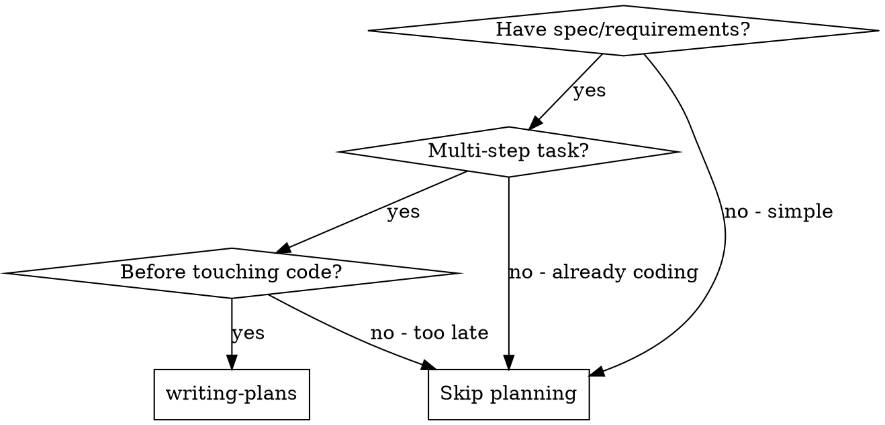

<!-- ===== X∞ COMPLIANCE LAYER (auto-applied by skill-architecture-standard) ===== -->
# writing-plans — X∞ Compliance Layer

## 1. IDENTITY
Skill milik user: `writing-plans`. Mengikuti Skill Architecture Standard X∞ (wajib).

## 2. PURPOSE
Menyediakan kemampuan writing-plans kepada agent saat relevan.

## 3. METADATA
- name: writing-plans
- version: 1.0.0
- standard: Skill Architecture Standard X∞ (21-node)
- scope: lihat body domain
- depends_on: tidak ada (mandiri)

## 4. TRIGGER ENGINE
Aktif ketika user meminta hal yang cocok dengan deskripsi di atas.
Negative trigger: di luar scope deskripsi.

## 5. CONTEXT ENGINE
Baca OS/ARCH/runtime sebelum bertindak. Termux Android ARM64 ≠ Ubuntu x86_64.

## 6. DECISION POLICY
IF uncertainty → VERIFY
IF high risk → ASK/STOP
IF tool unavailable → ALTERNATIVE
IF action fails → RECOVER

## 7. REASONING POLICY
Evidence-first. Bedakan FAKTA vs HIPOTESIS. Confidence: CONFIRMED/LIKELY/POSSIBLE/UNKNOWN.

## 8. EXECUTION POLICY
Ambil tindakan relevan, lalu VERIFY. Jangan klaim sukses sebelum diverifikasi.

## 9. TOOL POLICY
Pilih tool berdasar kebutuhan+konteks. Jangan asal panggil semua tool.

## 10. MEMORY POLICY
Ingat hal relevan; abaikan noise. Retrieve saat dibutuhkan, update bila berubah.

## 11. VERIFICATION ENGINE
ACTION → VERIFY → SUCCESS? Jika tidak: DIAGNOSE → RETRY/CHANGE STRATEGY.

## 12. ERROR RECOVERY
transient→retry; timeout→backoff; auth→credential check; dependency→diagnosis; unknown→investigate.

## 13. SECURITY GUARDRAILS
NEVER log secret. REDACT API KEY/TOKEN/PASSWORD/SECRET sebelum simpan. PII: MINIMIZE→REDACT→HASH.

## 14. EVALUATION
Self-eval: capai goal? terverifikasi? ada asumsi? ada gagal? Kirim ke Agent Evaluation Engine.

## 15. OBSERVABILITY
Emit: START/PROGRESS/TOOL CALL/ERROR/RETRY/SUCCESS/FAILURE + TRACE_ID (tanpa secret).

## 16. PERFORMANCE OPTIMIZATION
FULL→OPTIMIZED→LOW RESOURCE mode bila terbatas. Prioritas: TASK>SAFETY>RELIABILITY.

## 17. SELF-IMPROVEMENT
USE→OBSERVE→EVALUATE→FIND WEAKNESS→IMPROVE→TEST→NEW VERSION (via evaluasi+regresi).

## 18. VERSIONING
Semver. Perubahan struktur = MAJOR. CHANGELOG wajib.
**CHANGELOG**
- 1.0.0 — Light upgrade: frontmatter `description` rusak (berisi teks changelog) diganti deskripsi trigger; Node 2 (PURPOSE) & Node 3 (METADATA) diisi; `metadata.openclaw.version` diset 1.0.0. Body domain dipertahankan.

## 19. COMPATIBILITY
Tahu OS/ARCH/RUNTIME/versi/tool/API tersedia.

## 20. KNOWLEDGE SOURCES
Trust hierarchy: OFFICIAL>PRIMARY>REPUTABLE>COMMUNITY>UNKNOWN. Tandai VERIFIED/LIKELY/UNCERTAIN/OUTDATED/CONFLICTING.

## 21. EXIT CONDITIONS
Berhenti pada: SUCCESS/FAILURE/BLOCKED/NEED USER/NEED CREDENTIAL/NEED TOOL/NEED VERIFICATION.
<!-- ===== END X∞ COMPLIANCE LAYER ===== -->


# Writing Plans

## Overview

Write comprehensive implementation plans assuming the engineer has zero context for our codebase and questionable taste. Document everything they need to know: which files to touch for each task, code, testing, docs they might need to check, how to test it. Give them the whole plan as bite-sized tasks. DRY. YAGNI. TDD. Frequent commits.

Assume they are a skilled developer, but know almost nothing about our toolset or problem domain. Assume they don't know good test design very well.

**Announce at start:** "I'm using the writing-plans skill to create the implementation plan."

**Context:** If working in an isolated worktree, it should have been created via the `superpowers:using-git-worktrees` skill at execution time.

**Save plans to:** `docs/superpowers/plans/YYYY-MM-DD-<feature-name>.md`
- (User preferences for plan location override this default)

## When to Use



**Use when:**
- You have a spec or requirements document
- Task involves multiple steps
- Before writing any code

**Don't use when:**
- Simple single-step task
- Already started coding
- No clear requirements

## Scope Check

If the spec covers multiple independent subsystems, it should have been broken into sub-project specs during brainstorming. If it wasn't, suggest breaking this into separate plans — one per subsystem. Each plan should produce working, testable software on its own.

## File Structure

Before defining tasks, map out which files will be created or modified and what each one is responsible for. This is where decomposition decisions get locked in.

- Design units with clear boundaries and well-defined interfaces. Each file should have one clear responsibility.
- You reason best about code you can hold in context at once, and your edits are more reliable when files are focused. Prefer smaller, focused files over large ones that do too much.
- Files that change together should live together. Split by responsibility, not by technical layer.
- In existing codebases, follow established patterns. If the codebase uses large files, don't unilaterally restructure - but if a file you're modifying has grown unwieldy, including a split in the plan is reasonable.

This structure informs the task decomposition. Each task should produce self-contained changes that make sense independently.

## Task Right-Sizing

A task is the smallest unit that carries its own test cycle and is worth a
fresh reviewer's gate. When drawing task boundaries: fold setup,
configuration, scaffolding, and documentation steps into the task whose
deliverable needs them; split only where a reviewer could meaningfully
reject one task while approving its neighbor. Each task ends with an
independently testable deliverable.

## Bite-Sized Task Granularity

**Each step is one action (2-5 minutes):**
- "Write the failing test" - step
- "Run it to make sure it fails" - step
- "Implement the minimal code to make the test pass" - step
- "Run the tests and make sure they pass" - step
- "Commit" - step

## Plan Document Header

**Every plan MUST start with this header:**

```markdown
# [Feature Name] Implementation Plan

> **For agentic workers:** REQUIRED SUB-SKILL: Use superpowers:subagent-driven-development (recommended) or superpowers:executing-plans to implement this plan task-by-task. Steps use checkbox (`- [ ]`) syntax for tracking.

**Goal:** [One sentence describing what this builds]

**Architecture:** [2-3 sentences about approach]

**Tech Stack:** [Key technologies/libraries]

## Global Constraints

[The spec's project-wide requirements — version floors, dependency limits,
naming and copy rules, platform requirements — one line each, with exact
values copied verbatim from the spec. Every task's requirements implicitly
include this section.]

---
```

## Task Structure

````markdown
### Task N: [Component Name]

**Files:**
- Create: `exact/path/to/file.py`
- Modify: `exact/path/to/existing.py:123-145`
- Test: `tests/exact/path/to/test.py`

**Interfaces:**
- Consumes: [what this task uses from earlier tasks — exact signatures]
- Produces: [what later tasks rely on — exact function names, parameter
  and return types. A task's implementer sees only their own task; this
  block is how they learn the names and types neighboring tasks use.]

- [ ] **Step 1: Write the failing test**

```python
def test_specific_behavior():
    result = function(input)
    assert result == expected
```

- [ ] **Step 2: Run test to verify it fails**

Run: `pytest tests/path/test.py::test_name -v`
Expected: FAIL with "function not defined"

- [ ] **Step 3: Write minimal implementation**

```python
def function(input):
    return expected
```

- [ ] **Step 4: Run test to verify it passes**

Run: `pytest tests/path/test.py::test_name -v`
Expected: PASS

- [ ] **Step 5: Commit**

```bash
git add tests/path/test.py src/path/file.py
git commit -m "feat: add specific feature"
```
````

## No Placeholders

Every step must contain the actual content an engineer needs. These are **plan failures** — never write them:
- "TBD", "TODO", "implement later", "fill in details"
- "Add appropriate error handling" / "add validation" / "handle edge cases"
- "Write tests for the above" (without actual test code)
- "Similar to Task N" (repeat the code — the engineer may be reading tasks out of order)
- Steps that describe what to do without showing how (code blocks required for code steps)
- References to types, functions, or methods not defined in any task

## Common Rationalizations

| Excuse | Reality |
|--------|---------|
| "I'll add placeholders and fill them later" | You won't. Write complete steps now. |
| "This step is obvious, no need for code" | Write the code. Obvious ≠ documented. |
| "The engineer can figure it out" | They shouldn't have to. Plan everything. |
| "I'll just describe what to do" | Show code blocks. Description ≠ implementation. |
| "The plan is getting too long" | Better long and complete than short and ambiguous. |
| "I know what this means" | You do. The engineer reading this might not. |

## Self-Review

After writing the complete plan, look at the spec with fresh eyes and check the plan against it. This is a checklist you run yourself — not a subagent dispatch.

**1. Spec coverage:** Skim each section/requirement in the spec. Can you point to a task that implements it? List any gaps.

**2. Placeholder scan:** Search your plan for red flags — any of the patterns from the "No Placeholders" section above. Fix them.

**3. Type consistency:** Do the types, method signatures, and property names you used in later tasks match what you defined in earlier tasks? A function called `clearLayers()` in Task 3 but `clearFullLayers()` in Task 7 is a bug.

If you find issues, fix them inline. No need to re-review — just fix and move on. If you find a spec requirement with no task, add the task.

## Execution Handoff

After saving the plan, offer execution choice:

**"Plan complete and saved to `docs/superpowers/plans/<filename>.md`. Two execution options:**

**1. Subagent-Driven (recommended)** - I dispatch a fresh subagent per task, review between tasks, fast iteration

**2. Inline Execution** - Execute tasks in this session using executing-plans, batch execution with checkpoints

**Which approach?"**

**If Subagent-Driven chosen:**
- **REQUIRED SUB-SKILL:** Use superpowers:subagent-driven-development
- Fresh subagent per task + two-stage review

**If Inline Execution chosen:**
- **REQUIRED SUB-SKILL:** Use superpowers:executing-plans
- Batch execution with checkpoints for review

## Quick Reference

| Situation | Action |
|-----------|--------|
| Have spec | Write plan |
| Multi-step task | Write plan |
| Before coding | Write plan |
| Plan written | Self-review |
| Self-review done | Offer execution choice |
| User chooses subagent | Use subagent-driven-development |
| User chooses inline | Use executing-plans |
